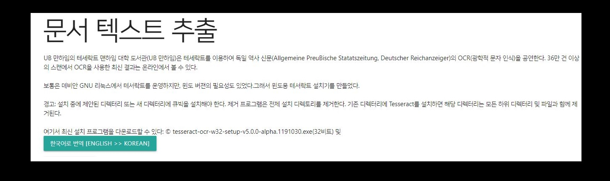

# 실시간 이미지 스캔 페이지
## 주제
사용자가 이미지를 업로드하면, 실시간으로 스캔된 이미지의 형태를 반환하는 웹페이지[OpenCV라이브러리 이용]
- 원근 변환을 이용하여 기울어진 이미지도 직사각형 형태로 자동변환기능 지원
- 부가기능 : 이미지파일에서 자동 Text 추출(영어,한글 이미지 지원), 영어 >> 한국어 번역 기능 지원

## URL
http://110.10.18.79:23023

## 개발 환경
- npm, express
- pytesseract(OCR Library with python3)
- opencv with python3
- PaPago Naver API

## 설치 방법
- npm install
- OCR라이브러리 pytesseract설치: https://github.com/tesseract-ocr/tesseract/wiki/4.0-with-LSTM#400-alpha-for-windows 
- pip3 install opencv-python

* * *
## 사용방법
* 이미지 파일 업로드

* 스캔 이미지 반환[문서 영역 자동 추출]

* 문서 TEXT 추출 [영어, 한글이미지 지원]

* 이미지 파일 업로드

* Text 추출.

* 영어->한글 번역 지원[Text Extraction이 수행된 상황에서 번역버튼 클릭]

* 한글 번역 결과

* Text Extraction이 수행된 상황에서 번역버튼 클릭

* * *

## 수정 내역
 * [20.05.11] 레파지토리 생성
 * [20.05.15] 이미지 스캔모듈 추가
 * [20.05.18] app.js 라우터분리, ocr모듈 추가
 * [20.05.19] AWS EC2 서버 로드 완료
 * [20.05.22] Read Me Update
 * [20.06.01] Ocr 모듈 줄바꿈 미반영 오류 해결
 * [20.06.12] Readme.md수정 설치방법 추가
 * [20.06.13] 네이버 파파고 API이용, 추출된 영문 텍스트를 한글로 번역하는 기능 추가
 * [20.06.14] 이미지 -> 한글 텍스트 추출 기능 추가